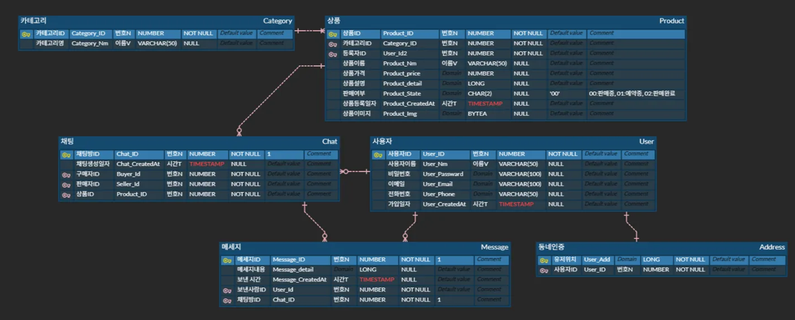
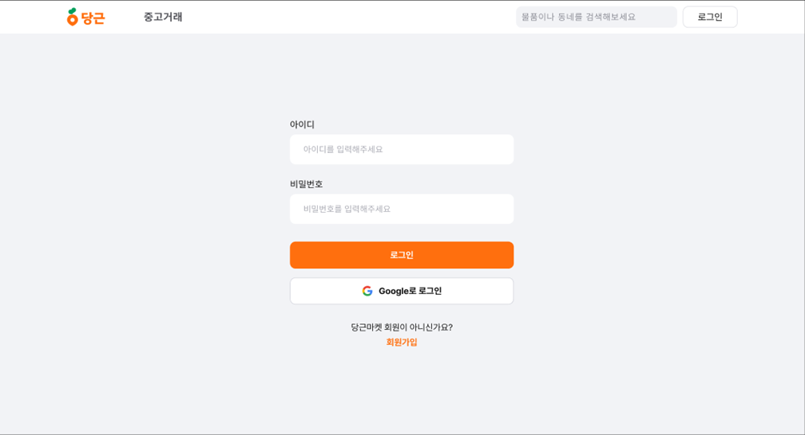
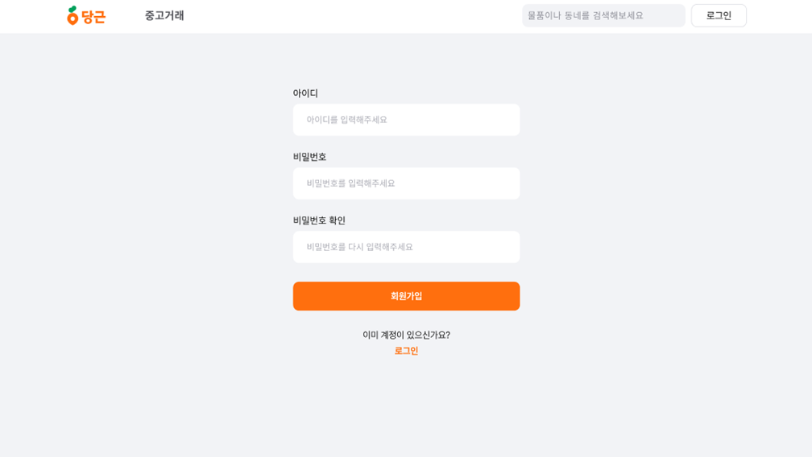
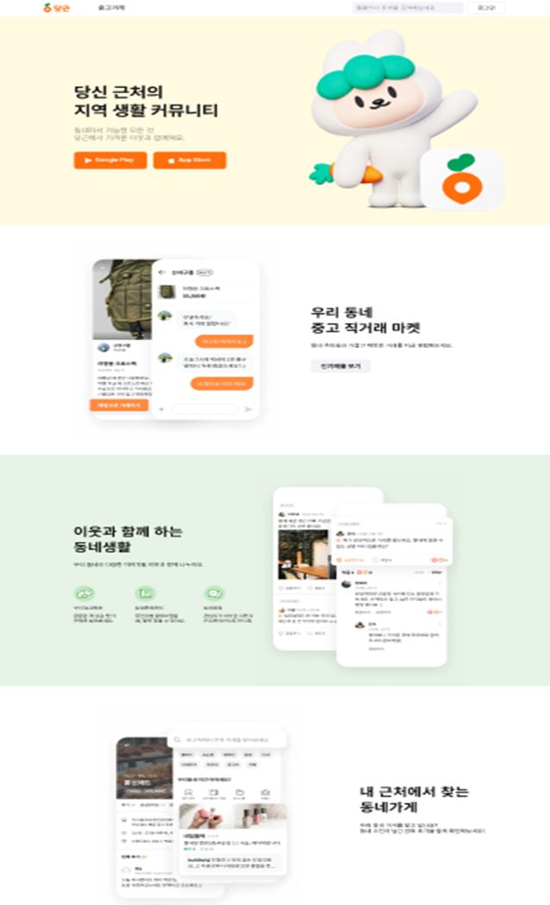
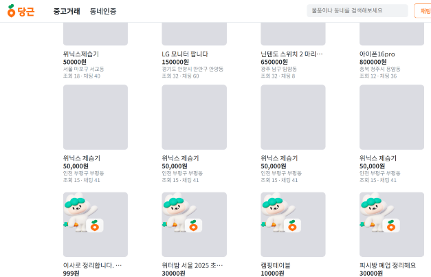
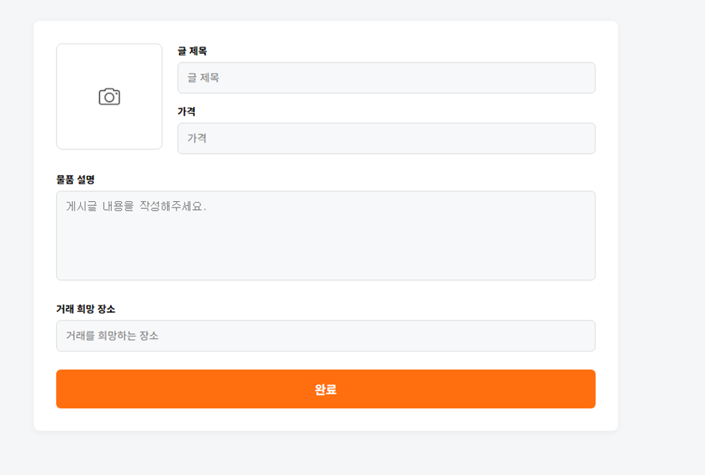
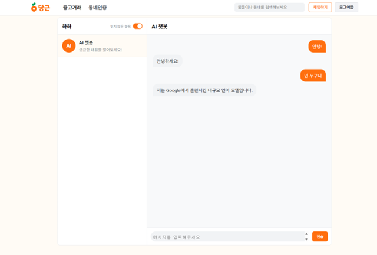
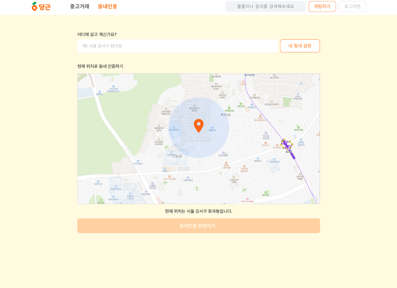

# 🥕 당근마켓 클론 프로젝트

## 1. 프로젝트 소개

[오르미 11기 백엔드 개발자 부트캠프]  
**챗봇 상담사가 있는 지역 기반 중고거래 플랫폼** 클론 프로젝트

💡 **당근마켓 클론페이지**는 지역 기반 중고거래 플랫폼인 당근마켓(Daangn Market)의 핵심 기능을 모방하여 구현한 웹 애플리케이션입니다.  
실시간 채팅과 **AI 챗봇 고객센터**를 통해 거래 지원을 제공합니다.

### 🔧 개발 목적
- 지역 기반 중고거래 플랫폼의 기능 이해
- CRUD, 인증, 채팅 등 실전 기능 구현
- **CI/CD 파이프라인을 통한 자동 배포 경험**
- 반응형 웹 및 사용자 친화적 UI/UX 설계

---

## 2. 사용 기술 스택

### Backend
- Java 17, Spring Boot, Spring MVC
- Spring Security, OAuth2 (Google 로그인)
- JPA, Hibernate
- WebSocket (실시간 채팅)

### Frontend
- HTML5, CSS3 (SCSS), JavaScript (ES6+)
- Thymeleaf

### AI / 챗봇
- OpenAI GPT API
- JSON 파싱 및 프롬프트 구조화

### Infrastructure & DevOps
- AWS EC2 (배포), AWS S3 (이미지 업로드)
- MySQL, PostgreSQL
- GitHub Actions (CI/CD)
- Git, IntelliJ IDEA

### 협업 도구
- GitHub (이슈/PR 관리)
- Notion (기획/정리)
- Discord (실시간 회의)
- Figma (디자인 참고)

---

## 3. 팀원 소개 및 역할

| 이름     | GitHub | 담당 역할 |
|----------|--------|-----------|
| 👑 김재경 | [Jaekyung89](https://github.com/Jaekyung89) | 팀장, 챗봇 연동, Trade 페이지 |
| 이소연    | [BlueGiraffe07](https://github.com/BlueGiraffe07) | 메인페이지, 발표자료, README 정리 |
| 김예은    | [yeeunkim7](https://github.com/yeeunkim7) | **소셜 로그인, 회원가입, AWS EC2 CI/CD 배포 담당** |
| 김민형    | [KimTeaHyeong1](https://github.com/KimTeaHyeong1) | 게시글(Post) 기능, 채팅 페이지 |

> 🎨 [피그마 디자인 시안 바로가기](https://www.figma.com/design/kSMua8TOVGIIPbNH1jie1Q/%EC%98%A4%EB%A5%B4%EB%AF%B8-%ED%94%84%EB%A1%9C%EC%A0%9D%ED%8A%B8-%EB%8B%B9%EA%B7%BC%EB%A7%88%EC%BC%93Web-%ED%81%B4%EB%A1%A0%EC%BD%94%EB%94%A9-?node-id=0-1&p=f)

---

## 4. ERD 구조

> 📌 ERD 다이어그램 (db 설계)

---

## 5. 페이지 구성 및 주요 기능

### 페이지별 주요 기능

- 로그인(Login)

- 회원가입(Register)

- 메인페이지(MainPage)

- 상품거래(Trade)

- 상품 상세(Trdae-item)

- 상품 등록(Trade-write)

- AI채팅(Chatbot)

- 위치(AreaConfirm)


### 4-2. 페이지 주요기능
| 페이지 | 경로 | 주요 기능 |
|--------|------|-----------|
| 메인페이지 | `/` | 서비스 소개, 인기매물, 인기검색어 |
| 회원가입 | `/register` | 이메일, 비밀번호, 닉네임 입력 |
| 로그인 | `/login` | 이메일 로그인, Google OAuth |
| 상품 목록 | `/trade` | 인기 중고 거래 목록 조회 |
| 상품 상세 | `/trade/item/{id}` | 상세 정보, 채팅 시작 |
| 상품 등록 | `/trade/write` | 이미지 포함 상품 등록 폼 |
| 검색 | `/search` | 키워드 검색 + 페이지네이션 |
| 채팅 | `/chat` | WebSocket 실시간 채팅 |
| 챗봇 | `/chatBot` | OpenAI 기반 고객센터 응답 |
| 마이페이지 | `/mypage` | 내 거래, 관심글, 설정 |
| 위치 인증 | `/confirm` | Google Maps API 활용 인증 |

---

## 5. 챗봇 기능 상세

| 항목 | 설명 |
|------|------|
| 목적 | 고객센터 자동화, FAQ 응답 |
| API | OpenAI GPT API 사용 |
| 제공 기능 | - 게시글 등록 안내<br>- 거래 주의사항<br>- 계정 오류 처리<br>- 챗 재연결 안내 |
| 위치 | 우측 하단 플로팅버튼 또는 마이페이지 → 고객센터 |

---


## 6. 챗봇 기능 상세

| 항목 | 설명 |
|------|------|
| 목적 | 고객센터 자동화, FAQ 응답 |
| API | OpenAI GPT API |
| 제공 기능 | 게시글 등록 안내, 거래 주의사항, 계정 오류 처리, 재연결 안내 |
| 위치 | 우측 하단 플로팅 버튼, 마이페이지 → 고객센터 |

---

## 7. 디렉토리 구조

```text
Danggeun/
├── db/
├── src/
│   ├── main/
│   │   ├── java/org/example/danggeun
│   │   │   ├── address/
│   │   │   ├── areaconfirm/ (controller, dto, entity, repository, service)
│   │   │   ├── category/
│   │   │   ├── chat/ (controller, entity, service, websocket)
│   │   │   ├── common/
│   │   │   ├── config/
│   │   │   ├── exception/
│   │   │   ├── mainpage/
│   │   │   ├── message/
│   │   │   ├── s3/
│   │   │   ├── search/
│   │   │   ├── security/
│   │   │   ├── trade/ (controller, dto, entity, repository, service)
│   │   │   └── user/ (controller, dto, entity, repository, service)
│   │   └── resources/
│   │       ├── static/ (css, js, images, uploads)
│   │       └── templates/ (thymeleaf views)
│   └── test/java/org/example/danggeun
├── uploads/
├── pom.xml
├── deploy.sh
└── README.md

---

## 8. CI/CD 배포 흐름

본 프로젝트는 **GitHub Actions + AWS EC2**를 활용한 자동 배포 파이프라인을 구축했습니다.  
`main` 브랜치에 push가 발생하면, GitHub Actions가 실행되어 EC2 서버로 SSH 접속 후 `deploy.sh` 스크립트를 실행하여 자동 배포됩니다.

### 배포 다이어그램

)

### 배포 흐름
1. 개발자가 `git push origin main` 실행
2. GitHub Actions Workflow 자동 실행
3. SSH를 통해 AWS EC2에 접속
4. `deploy.sh` 스크립트 실행
   - 최신 코드 pull
   - Maven 빌드
   - Spring Boot 서비스 재시작
5. 배포 완료 후, `systemctl status`로 서비스 상태 확인
6. 브라우저를 통해 EC2 IP로 서비스 접속 가능

---

## 9. 브랜치 전략 & 코드 컨벤션

### 브랜치 정책
- `main`: 배포용 브랜치
- `feature/기능명`: 기능 단위 작업
- Pull Request 기반 병합, 코드 리뷰 필수  
- 미완성 코드 main 병합 ❌

### 코드 컨벤션
- 문자열: `"` 사용
- 세미콜론 `;` 필수
- 들여쓰기: 4칸 space
- 변수/함수: camelCase, 클래스: PascalCase
- 상수: UPPER_SNAKE_CASE
- 연산자/콤마 뒤 공백
- 불필요한 줄바꿈 금지

---

## 10. 기대 효과

- **실무에 가까운 CI/CD 자동배포 경험 확보 (GitHub Actions + AWS EC2)**
- 챗봇 기능 통한 **AI 연동 경험 강화**
- 사용자 중심 서비스 설계 및 개선 경험
- Git 기반 협업 및 코드리뷰 문화 경험
